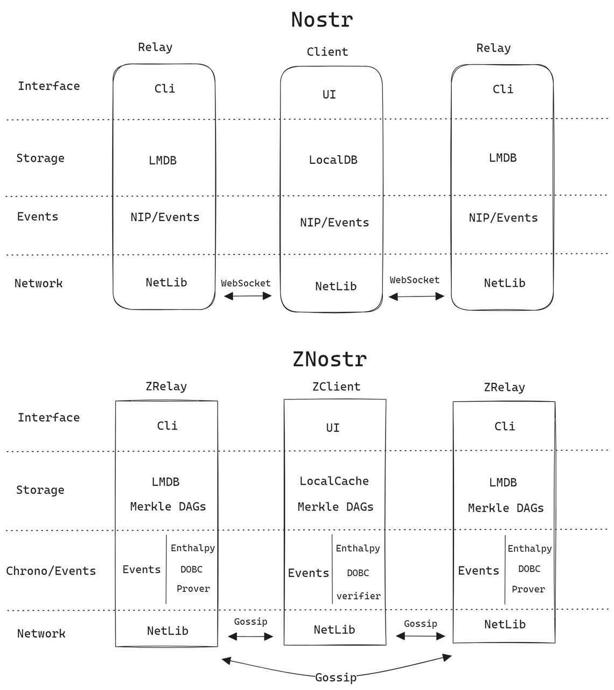

# Architecture

<figure><figcaption>
Architecture
</figcaption></figure>

## LMDB

LMDB (Lightning Memory-Mapped Database) is a high-performance key-value store database library. It was developed by Symas Corporation and is designed for use in embedded systems and high-performance applications. LMDB provides a reliable, efficient, and lightweight solution for storing and retrieving data.

LMDB uses memory-mapped files for storage, which allows direct access to the data in memory without the need for additional memory copies. This approach provides excellent performance and scalability, making LMDB suitable for applications that require fast data access and low latency.

Key features of LMDB include:

1. Transactions: LMDB supports multi-threaded access and concurrent transactions, ensuring data consistency and integrity.
2. ACID (Atomicity, Consistency, Isolation, Durability) properties: LMDB provides transactional support with atomic updates, ensuring data integrity.
3. Memory efficiency: LMDB is highly memory-efficient because it uses memory-mapped files and supports memory-mapped databases. It avoids unnecessary memory copies and cache thrashing.
4. High performance: LMDB is optimized for speed and can handle a large number of concurrent reads and writes efficiently.
5. Small footprint: The LMDB library is compact and has a minimal dependency footprint, making it easy to integrate into applications.
6. Crash recovery: LMDB maintains a consistent state even in the event of a system crash. It provides mechanisms to recover data integrity and consistency after a failure.
7. Cross-platform support: LMDB is available for various platforms, including Linux, Windows, macOS, and other UNIX-like systems.

LMDB is often used in applications that require fast and efficient data storage, such as databases, caching systems, message queues, and other high-performance systems.

## Gossip

In the context of computer science and distributed systems, gossip refers to a communication protocol used by nodes or processes in a network to exchange information or propagate updates. The term "gossip" is inspired by the way information spreads among individuals through casual conversations or rumors.

Gossip protocols are typically decentralized and rely on peers exchanging information with each other in a peer-to-peer fashion. Each node in the network randomly selects a few other nodes to communicate with, and they share information or updates they have. The receiving nodes then continue the process by gossiping the received information to other nodes they randomly select, and this dissemination continues throughout the network.

Gossip protocols have several characteristics that make them useful in distributed systems:

1. Scalability: Gossip protocols are highly scalable as they distribute information across the network without relying on a central authority. Each node only needs to communicate with a few randomly selected peers, enabling efficient dissemination of information in large-scale systems.
2. Fault tolerance: Gossip protocols are resilient to failures and network partitions. If a node fails or becomes disconnected, information can still spread through alternate paths created by the random selection of peers.
3. Eventual consistency: Gossip protocols aim to achieve eventual consistency, meaning that eventually, all nodes in the network will receive the updates or information being gossiped. However, due to the random nature of gossiping, there may be some delay in propagating information to all nodes.
4. Anti-entropy mechanisms: Gossip protocols often employ anti-entropy mechanisms to ensure the consistency of information. These mechanisms involve comparing data between nodes and reconciling any differences or conflicts.

Gossip protocols find applications in various distributed systems, such as peer-to-peer networks, distributed databases, distributed storage systems, and decentralized consensus algorithms. They provide a scalable and fault-tolerant approach to disseminate information and keep nodes in the network synchronized.

## Nostr

Nostr is a protocol, designed for simplicity, that aims to create a censorship-resistant global social network.

The protocol is based on very simple & flexible `event` objects (which are passed around as plain JSON) and uses standard elliptic-curve cryptography for keys and signing. The only supported transport is websockets connections from clients to relays. This makes it easy to write clients and relays and promotes software diversity.

## Clock

clock is a very important part of the whole system. How to determine the sequence of time occurrence of different nodes in a distributed system is very challenging. There are usually three types of clocks

1. Lamport Clock (Lamport Clock) : Lamport clock is a logical clock algorithm proposed by Leslie Lamport in 1978. Each process maintains an incremental counter, and when a process executes an event, its logical clock increases. The Lamport clock provides some order in the order in which events occur, but does not capture the true order of events.
2. Vector Clock: A vector clock is a logical clock algorithm proposed by Collin Fidge in 1988. Each process maintains a vector where each element corresponds to a process in the system, and the value of the vector represents the logical clock of that process. When a process executes an event, its vector clock is updated accordingly. Vector clocks provide more ordering information and can capture causal relationships between events.
3. Physical Clock: The physical clock refers to the real time measurement. The logical clock is an abstract concept used to sequentialize the sequence of events in a distributed system. Here are some common logical clocks

